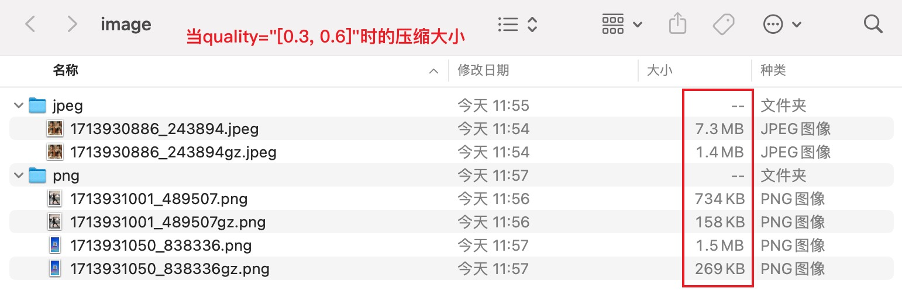

# imagemin-server

<p align="center" ></p>

开发这么一个项目是因为我需要一个图像压缩服务，而我了解的`imagemin`兼容性是个很大的问题，网上也有对应的API服务，我不觉得这个东西也需要花钱解决。因此选择使用[Bun dev | NodeJS prod] + Express。

To install dependencies:

```bash
bun install
```

To run:

```bash
bun run index.ts
```

This project was created using `bun init` in bun v1.1.2. [Bun](https://bun.sh) is a fast all-in-one JavaScript runtime.

## 接口文档

### 压缩图片
> url: `/compress`
> method: `POST`

请求参数（接口请求案例：[click here](./src/md/request.md)）：

| 参数名 | 类型 | 描述 |
| ----------- | ----------- | ----------- |
| file        | file        | 需要被压缩的图像，请上传一个文件实例 |
| quality     | string      | 质量参数，例如：`[0.3, 0.6]`，注意参数类型是字符串，请按照指定格式来传参，中间空格无要求 |

响应：
```json
{
  "status": 0,
  "messgae": "success",
  "data": {
    "uncompression": {
      "url": "http://192.168.1.16:9093/public/image/png/1713933615_629111.png",
      "size": "1.46 MB"
    },
    "compressed": {
      "url": "http://192.168.1.16:9093/public/image/png/1713933615_629111gz.png",
      "size": "262.60 KB"
    },
    "percentage": "17.56%"
  }
}
```


## 部署

我在项目中加入了dockerfile，你可以使用docker来部署：

```bash
# 构建镜像
docker buildx build --push --platform linux/amd64 -t 31.133.33.333:9000/imagemin-server .
```

## 注意事项
本项目未使用数据库，每次请求传的图片文件以及压缩文件都会保存到服务器并在返回结果中提供网络链接，但请勿在生产环境中使用，不保证链接的长久有效。

## Bun的兼容问题
因为我的新项目使用Bun开发以及部署，而如果要继承imagemin会遇到一个问题：
```
TypeError: isNaturalNumber is not a function. (In 'isNaturalNumber(count, !0)', 'isNaturalNumber' is an instance of Module)
```

但是这个问题用NodeJS就不会出现，它在目前最新Bun v1.1.4版本还没有得到处理：https://github.com/oven-sh/bun/issues/9267


/public有惊喜😁

## 联系我
全栈开发接商单，加QQ: 57878778
